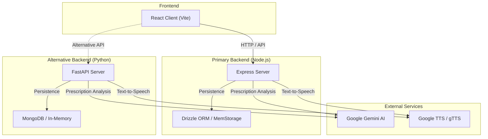
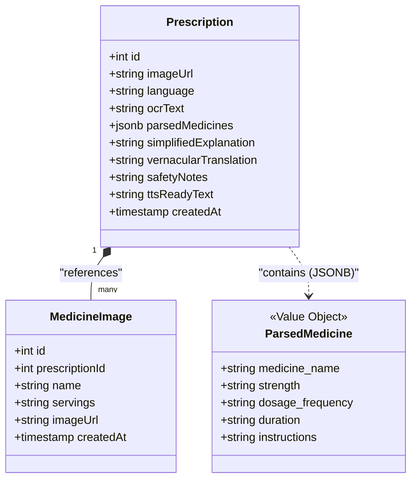
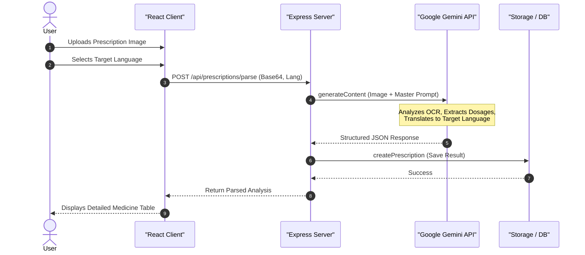
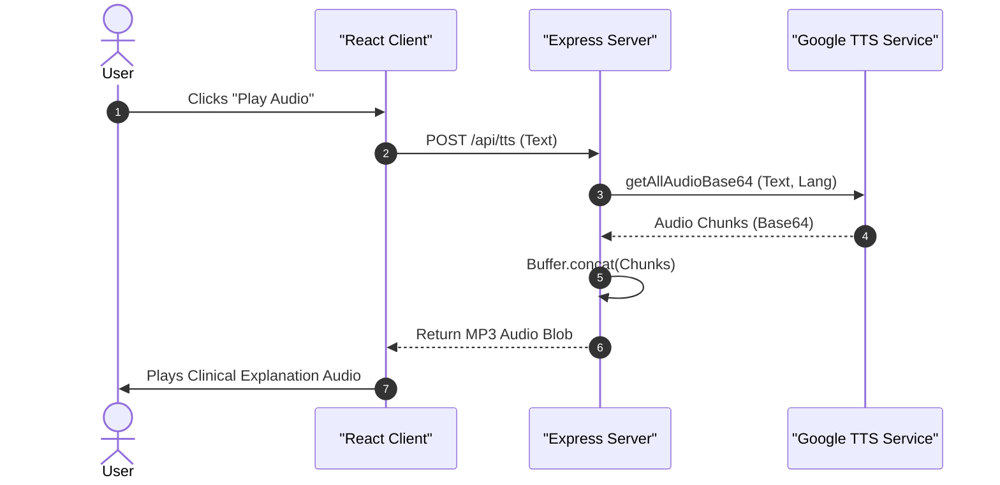

# VaidyaVaani Project UML Diagrams

This document contains the UML diagrams for the **VaidyaVaani** medical AI application. The project is a full-stack application designed to parse medical prescriptions, provide multilingual explanations, and facilitate medication tracking.

## 1. System Architecture

The following component diagram illustrates the high-level architecture of VaidyaVaani, showing the relationship between the frontend, the multiple backend options, and the external AI services.

## 2. Data Model

The data model is defined using Drizzle ORM and shared between the client and server. It consists of two primary entities: [Prescription](file:///d:/VAIDHYAVAANI/shared/schema.ts#38-39) and [MedicineImage](file:///d:/VAIDHYAVAANI/shared/schema.ts#40-41).

## 3. Prescription Analysis Flow

The following sequence diagram shows the step-by-step process of parsing a prescription image.

## 4. Text-to-Speech (TTS) Flow

This diagram shows how the vernacular explanation is converted to voice for accessibility.

